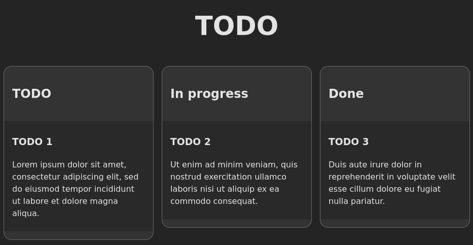
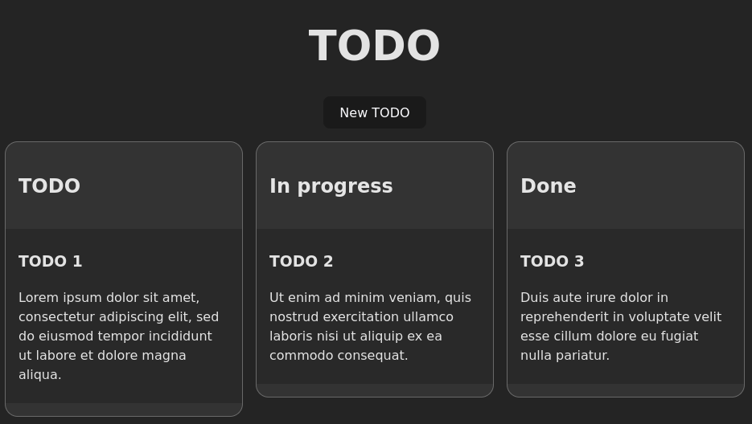
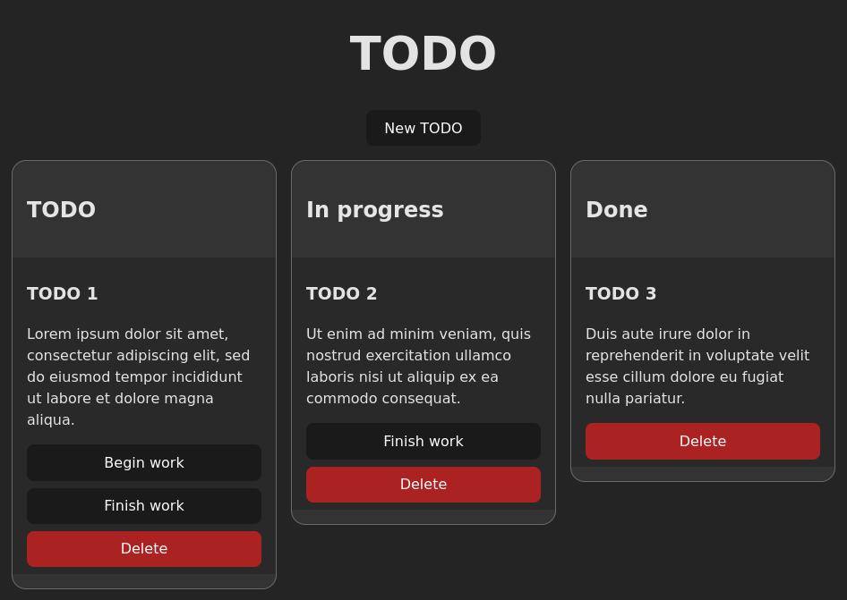
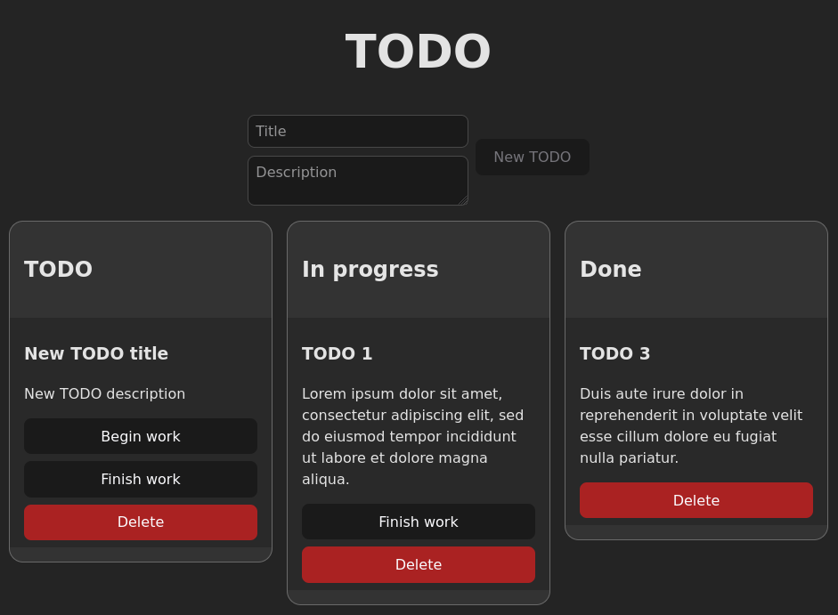

# KnowIT React Frontend Test

## Instalacija

Upišite sljedeće naredbe u terminal otvoren u direktoriju u kojem želite preuzeti repozitorij:

```bash
git clone git@github.com:know-informacijske-tehnologije/frontend-test1-react.git
cd frontend-test1-react
npm i
```

## Pokretanje projekta

Projekt se pokreće naredbom:

```bash
npm run dev
```

Ako se projekt uspješno pokrenuo, ispis u terminalu bi trebao izgledati slično ovome:

```
VITE v4.3.9  ready in 218 ms

➜  Local:   http://localhost:5173/
➜  Network: use --host to expose
➜  press h to show help
```

Svaki puta kada spremite neki file nakon editiranja, aplikacija u browseru će se automatski refreshati.

## Struktura projekta

Projekt je kreiran sa komandom `npm create vite@latest`. Glavni entrypoint se standardno nalazi u `src/main.tsx`. Komponenta koja se prikazuje po defaultu nalazi se u `App.tsx`.

Daljnje strukturiranje projekta je proizvoljno. Slobodno koristite `context`, storeove, kreirajte nove komponente, importajte neki library, itd.

## Završavanje i predavanje testa

Kada završite sa dolje opisanim zadacima, zipajte cijeli projekt i pošaljite ga na borna.lang@knowit.tech. Prije zipanja potrebno je obrisati `node_modules` folder, kako bi zip bio što manji.

## Zadatak

Radi pravilnog strukturiranja projekta, pročitajte sve zadatke prije nego što krenete pisati kod - odluke koje donesete u prvom zadatku mogu učiniti kasnije zadatke težima.

Izgled finalne aplikacije je proizvoljan - ne morate replicirati CSS iz primjera. Ne očekujemo prekrasnu finalnu aplikaciju - funkcionalnosti su na prvom mjestu.

Ako nešto nije jasno u zadatku, slobodno otvorite issue!

### Osnovni layout i prikaz statičkih podataka

U fileu "src/App.tsx", u varijabli `data`, nalazi se array TODO objekata. Sve objekte u arrayu potrebno je prikazati u tri stupca (kao kanban), u ovisnosti o statusu.

Primjer rezultata:


### Novi TODO

U fileu "src/App.tsx" postoji funkcija `add_todo`. Ta funkcija dodaje novi TODO u `data` array. Funkcija ne prima nikakve argumente - naslov i opis novog TODOa će uvijek biti isti.

Potrebno je dodati `button` i povezati ga sa ovom funkcijom - klik na button bi trebao dodati novi TODO u stupac "TODO".



### Akcije

Sada je potrebno na svaki TODO, ovisno u kojem se statusu nalazi, dodati buttone koji će vršiti određene akcije.

Točnije, po statusima:

- `TODO` mora prikazati 2 buttona:
    1. "Begin work" - prebacuje TODO u status "In progress"
    2. "Finish work" - prebacuje TODO u status "Done"
- `In progress` mora prikazati 1 button:
    1. "Finish work" - prebacuje TODO u status "Done"

Dodatno, na svaki TODO (bez obzira o statusu) potrebno je dodati button za brisanje ("Delete").



### Forma

Na kraju, potrebno je dovršiti funkcionalnost dodavanja novih TODOa. Button `Add TODO` trebao bi se nalaziti pored nove forme koju je potrebno napraviti.

Ta nova forma sadrži 2 polja:

- Title - Obični single-line input
- Description - Multi-line input (textarea)

Button `Add TODO` mora biti zasivljen (disabled) dok oba polja ne budu popunjena.

Klikom na button se kreira novi TODO u statusu `todo`, sa naslovom i opisom iz `Title` i `Description` polja, te se polja isprazne.



## Dodatni bodovi

Kada završite sa zadacima, možete implementirati dodatne funkcionalnosti ako želite. Sve što napravite biti će pregledano i uzeto u obzir. Impresionirajte nas!

Neke ideje:
- uređivanje naslova/opisa TODOa nakon što je dodan
- responzivni css
- drag & drop TODOa iz jednog stupca u drugi
- mogućnost selektiranja i uređivanja više TODOa odjednom
- ...

## Sretno!
